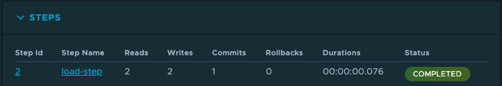

# Spring Batch + GemFire

Example running standalone

```shell

docker network create gemfire-cache --driver bridge
mkdir -p /Users/devtools/repositories/RDBMS/PostgreSQL/pg-docker
docker  run --name postgresql  --network gemfire-cache --rm -it -p 5432:5432 -e ALLOW_EMPTY_PASSWORD=yes -v /Users/devtools/repositories/RDBMS/PostgreSQL/pg-docker:/bitnami/postgresql bitnami/postgresql:latest   
```

Run Locator
```shell
docker run -it -e 'ACCEPT_TERMS=y' --rm --name gf-locator --network=gemfire-cache -p 10334:10334 -p 7070:7070 gemfire/gemfire:10.0.3 gfsh start locator --name=locator1
```

Setup Pdx

```shell
docker run -it -e 'ACCEPT_TERMS=y' --network=gemfire-cache gemfire/gemfire:10.0.3 gfsh -e "connect --jmx-manager=gf-locator[1099]" -e "configure pdx --read-serialized=true --disk-store"
```

Run Cache Server
```shell
docker run -it -e 'ACCEPT_TERMS=y' --rm --name gf-server1 --network=gemfire-cache -p 40404:40404 gemfire/gemfire:10.0.3 gfsh start server --name=server1 --locators=gf-locator\[10334\]
```
Setup GemFire Regions

```shell
docker run -it -e 'ACCEPT_TERMS=y' --network=gemfire-cache gemfire/gemfire:10.0.3 gfsh -e "connect --jmx-manager=gf-locator[1099]" -e "create region --name=Account --type=PARTITION"
```


Run initial to test and create database

```shell
docker run --name account-batch   --rm -it  --network=gemfire-cache -e "spring.profiles.active=postgres" -e "db.schema=cache_accounts" -e "spring.data.gemfire.pool.default.locators=gf-locator[10334]" -e "batch.jdbc.url=jdbc:postgresql://postgresql:5432/postgres"  -e "batch.jdbc.username=postgres" -e "spring.sql.init.platform=postgres" -e "batch.job.repository.create=true" -e "spring.datasource.url=jdbc:postgresql://postgresql:5432/postgres" -e "spring.datasource.username=postgres" -e "batch.load.accounts=true" -e "account.data.count=500"  -e "account.data.batch.size=50" cloudnativedata/account-batch:0.0.1-SNAPSHOT
```

-------------------

# GemFire Management Console (Gideon Console)

1. Login
```shell
docker login registry.tanzu.vmware.com
```

2. Pull Image
```shell
docker pull registry.tanzu.vmware.com/gemfire-management-console/gemfire-management-console:1.2.0
```
```shell

docker run -p 8080:8080 --rm -it --name gideon-console   --network=gemfire-cache registry.tanzu.vmware.com/gemfire-management-console/gemfire-management-console:1.2.0
```

Open Management Console
```shell
open http://localhost:8080/
```

1 - Click -> Connect 

2 -  Enter Connection Setting

- Enter cluster nickname: gemfire
- Host: gf-locator
- Port: 7070

Then  connect to cluster

3 - Use the Data Explore to view the loaded customer data

--------

# Spring Cloud DataFlow

The following is an example DSL to run the batch in Spring Cloud DataFlow

```shell
account-batch --db.schema=cache_accounts --spring.data.gemfire.pool.default.locators="localhost[10334]" --batch.jdbc.url="jdbc:postgresql://localhost:5432/postgres"  --batch.jdbc.username=postgres --spring.sql.init.platform=postgres --spring.liquibase.url="jdbc:postgresql://localhost:5432/postgres" --spring.liquibase.user=postgres  --batch.load.accounts=true --account.data.count=500  ---account.data.batch.size=50
```



--------------------------------------
## Docker building image

The following are the steps to build a docker image
```shell
mvn install
cd applications/account-batch
mvn spring-boot:build-image
```

Example for tagging and pushing to docker hub
```shell
docker tag account-batch:0.0.1-SNAPSHOT cloudnativedata/account-batch:0.0.1-SNAPSHOT
docker push cloudnativedata/account-batch:0.0.1-SNAPSHOT
```

