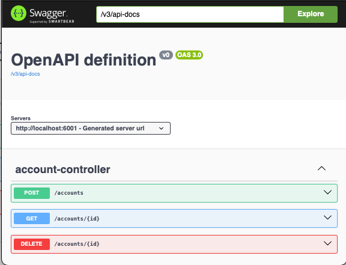

# account-service

The application is a [Spring Web](https://spring.io/web-applications) + [Spring Data for GemFire](https://docs.vmware.com/en/Spring-Data-for-VMware-GemFire/index.html) example


## Running 


```shell
java -jar applications/account-service/target/account-service-0.0.2-SNAPSHOT.jar --server.port=6001 --spring.data.gemfire.pool.default.locators="localhost[10334]"
```

# Demo Instructions 

Run Script to run a GemFire locator and server in Docker with example GemFire regions.

```shell
./deployments/local/scripts/docker/start-docker-gemfire.sh
```

Run account-service in Docker

```shell
docker run -p 6001:6001 --rm -it --name account-service -e "server.port=6001" -e "spring.data.gemfire.pool.default.locators=gf-locator[10334]" --network=gemfire-cache cloudnativedata/account-service:0.0.1-SNAPSHOT
```

Open Swagger UI for Testing the account-service

```shell
open http://localhost:6001
```




------------

# Access Gfsh


```shell
docker run -it -e 'ACCEPT_TERMS=y' --network=gf-network gemfire/gemfire:9.15.6 gfsh -e "connect jmx-manager=gf-locator[1099]" -e "list members"
```

In gfsh connect to the locator

```shell
connect --jmx-manager=gf-locator[1099]
```

In a Terminal post account data

```shell
curl -X 'POST' \
  'http://localhost:6001/accounts' \
  -H 'accept: */*' \
  -H 'Content-Type: application/json' \
  -d '{
  "id": "001",
  "name": "Acct 001"
}'

```

Query data in gfsh
```shell
query --query="select * from /Account"
```


## Docker building image

The following are the steps to build a docker image
```shell
mvn install
cd applications/account-service
mvn spring-boot:build-image
```

Example for tagging and pushing to docker hub
```shell
docker tag account-service:0.0.1-SNAPSHOT cloudnativedata/account-service:0.0.1-SNAPSHOT
docker push cloudnativedata/account-service:0.0.1-SNAPSHOT
```