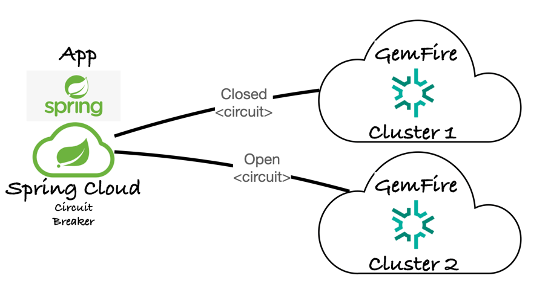

# Spring Data GemFire WAN Replication & Circuit Breaker Demo

This demo illustrates a resilient microservice architecture using **Spring Data GemFire** distributed across two distinct data centers (clusters) coupled with **Spring Cloud Circuit Breaker** (Resilience4j).




By leveraging active-active or active-passive Wide Area Network (WAN) replication, the architecture guarantees data availability. When the primary GemFire cluster encounters performance degradation or a complete outage, the circuit breaker trips, dynamically routing read and write requests to Client Region Aliases pointing to the secondary GemFire cluster.

---

## Architecture Overview

The system spans two environments: **Cluster A (Primary)** and **Cluster B (Secondary/DR)**. Under normal operating conditions, the microservice directs traffic to Cluster A. Changes are asynchronously replicated to Cluster B via standard GemFire WAN Gateways.

[Image of Geode WAN replication architecture with circuit breaker failover]

### Failover Mechanism
1. **Circuit State - CLOSED:** `AccountService` routes operations through `AccountRepository` targeting Cluster A.
2. **Outage/Latency Spike:** Cluster A becomes unavailable or breaches timeout thresholds.
3. **Circuit State - OPEN:** The circuit breaker trips. Subsequent calls immediately fast-fail away from Cluster A and activate the fallback path via `AccountRepositoryFallback`.
4. **Targeted Redirection:** `AccountRepositoryFallback` uses a configured client region alias mapped specifically to the pools/locators of Cluster B.

---

## Core Component: AccountService

The orchestration logic is  decoupled inside `AccountService`. It embeds distinct `readCircuitBreaker` and `writeCircuitBreaker` instances, ensuring that read performance anomalies do not unnecessarily choke or blind write pathways.

See [AccountService.java](src/main/java/io/cloudNativeData/spring/gemfire/account/service/AccountService.java)


## 

The example using the [GemFire region client alias](https://techdocs.broadcom.com/us/en/vmware-tanzu/data-solutions/tanzu-gemfire/10-2/gf/basic_config-data_regions-client_region_aliasing.html) introduced in [GemFire 10.2.3](https://techdocs.broadcom.com/us/en/vmware-tanzu/data-solutions/tanzu-gemfire/10-2/gf/about_gemfire.html).

Client region aliases allows a GemFire client to create a local region with a name that differs from the corresponding region on the server. This is useful when A single client needs to connect to multiple clusters (via separate pools) that each have a region with the same name. Without aliasing, the client cannot create two local regions with the same name. With aliasing, the client creates two distinctly named local regions that each proxy to the identically named server region on their respective cluster.


***************

## Resilience4j Circuit Breaker Default Configuration

The following configuration establishes the baseline timeout behavior and circuit breaker thresholds for all programmatically created circuit breakers across the microservice.


```java
    @Bean
    public Customizer<Resilience4JCircuitBreakerFactory> defaultCustomizer() {
    return factory -> factory.configureDefault(id -> new Resilience4JConfigBuilder(id)
    .timeLimiterConfig(TimeLimiterConfig.custom()
    .timeoutDuration(Duration.ofSeconds(timeOutSeconds)) // Sets the maximum allowed execution time
    .cancelRunningFuture(false)             // Controls whether the thread is interrupted on timeout
    .build())
    .circuitBreakerConfig(CircuitBreakerConfig.ofDefaults())
    .build());
    }
```

The configuration adjusts two primary subsystems: the Time Limiter (timeouts) and the Circuit Breaker (state tracking).
The Time Limiter acts as a protective guard rails on outbound network calls to prevent slow downstream dependencies from consuming all available container threads.

Determines whether Future.cancel(true) is called on the executing thread when a timeout occurs. Setting this to false means the calling thread receives a timeout exception immediately, but the underlying worker thread is allowed to finish its work in the background without being interrupted.


# Getting Started

Start 2 WAN connected GemFire clusters each with 3 cache servers.

```shell
./deployments/local/scripts/gemfire/ha/start-3-data-nodes-ha-clusters.sh
```


Use the following to pause a cache server in cluster 1

```shell
kill -STOP < Gemfire -PID> 
```

This will open the circuit breaker to cluster 2 for failures

Resumed it using 

```shell
kill -CONT < Gemfire -PID>.
```

This will close the circuit breaker to continue operations on cluster 1.

