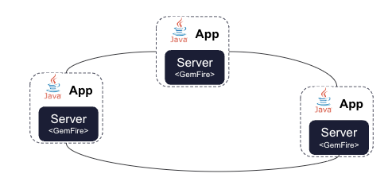

# GemFire Server - Spring Showcase



This directory provides an example of a Peer-To-Peer GemFire cluster
that using Spring Data GemFire.


The majority of the [Spring Data GemFire annotations have been **DEPRACTED** or removed](https://techdocs.broadcom.com/us/en/vmware-tanzu/data-solutions/spring-data-for-tanzu-gemfire/2-0/gf-sd-2-0/upgrading-1-x-to-2-x.html)  (ex: @CacheServerApplication).
You can still leverage Spring Data GemFire for your Tanzu GemFire client applications.  

The applications in this folder uses the GemFire API independently of the Spring Data for GemFire annotation to enable a Peer-to-Peer 
GemFire deployment. For detailed instructions for starting and managing Tanzu GemFire servers, see the [Tanzu GemFire documentation](https://techdocs.broadcom.com/us/en/vmware-tanzu/data-solutions/tanzu-gemfire/10-1/gf/configuring-running-running_the_cacheserver.html).


Prerequisite

- GemFire 10.x
- Java 17


See Sub-Projects

| Project                          | Notes                                                                         |
|----------------------------------|-------------------------------------------------------------------------------|
| [locator](locator)               | Spring Boot Application with Embedded GemFir eLocator                         |
| [account-server](account-server) | Spring Boot Application with Embedded GemFire Embedded Cache Server Data Node |

## GemFire Peer-to-Peer Overview

GemFire allows apps to embed a GemFire Cache within the application process space and participate in a cluster.


### Use Cases

- Java-Only Applications
- Simple stateful In-Memory Replication/Caching
- Edge Computing
- App-to-App Event Driven Process

### Peer-to-Peer Benefits

- Low Latency
- Simple deployment

### Challenges
- Tightly coupled application logic and data management.
- Scaling and management can be complex as the number of peers grows.


Note: The preferred approached to starting a GemFire cluster servers is with gfsh for client/server deployments for most use cases. 


# Getting Started Cluster

## Start locator

From Project Root

```shell
mkdir -p runtime/locator
java  --add-exports java.management/sun.management=ALL-UNNAMED  --add-exports=java.base/sun.nio.ch=ALL-UNNAMED --add-exports=java.management/com.sun.jmx.remote.security=ALL-UNNAMED --add-opens=java.base/java.lang=ALL-UNNAMED --add-opens=java.base/java.nio=ALL-UNNAMED --add-opens=jdk.management/com.sun.management.internal=ALL-UNNAMED -jar applications/server/locator/target/locator-0.0.1-SNAPSHOT.jar --gemfire.working.dir=runtime/locator  --spring.data.gemfire.pool.locators="localhost[10334]" --gemfire.locator.name=account-locator-1  --gemfire.locator.port=10334
```

## Start Server 1

From Project Root

```shell
mkdir -p runtime/server1
java  --add-exports java.management/sun.management=ALL-UNNAMED  --add-exports=java.base/sun.nio.ch=ALL-UNNAMED --add-exports=java.management/com.sun.jmx.remote.security=ALL-UNNAMED --add-opens=java.base/java.lang=ALL-UNNAMED --add-opens=java.base/java.nio=ALL-UNNAMED --add-opens=jdk.management/com.sun.management.internal=ALL-UNNAMED -jar applications/server/account-server/target/account-server-0.0.1-SNAPSHOT.jar  --spring.data.gemfire.pool.locators="localhost[10334]" --gemfire.working.dir=runtime/server1 --gemfire.server.name=account-srv1  --gemfire.server.port=40001
```

## Start Server 2

From Project Root

```shell
mkdir -p runtime/server2
java  --add-exports java.management/sun.management=ALL-UNNAMED  --add-exports=java.base/sun.nio.ch=ALL-UNNAMED --add-exports=java.management/com.sun.jmx.remote.security=ALL-UNNAMED --add-opens=java.base/java.lang=ALL-UNNAMED --add-opens=java.base/java.nio=ALL-UNNAMED --add-opens=jdk.management/com.sun.management.internal=ALL-UNNAMED  -jar applications/server/account-server/target/account-server-0.0.1-SNAPSHOT.jar  --gemfire.server.name=account-srv2 --spring.data.gemfire.pool.locators="localhost[10334]" --gemfire.working.dir=runtime/server2  --server.port=6012 --gemfire.server.port=40002
```

