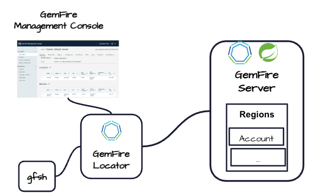
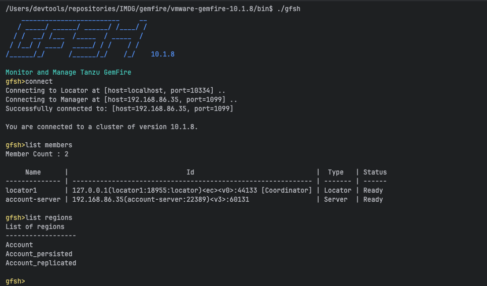
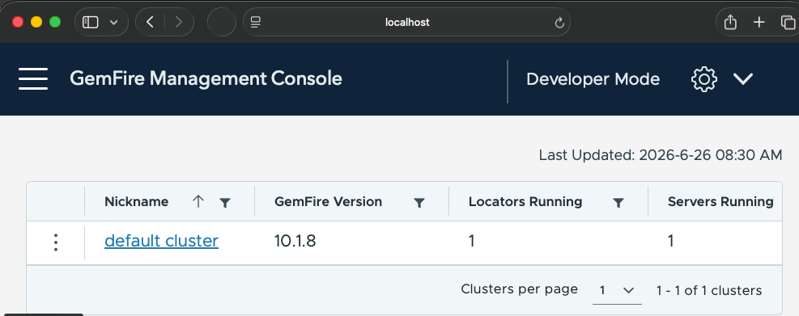
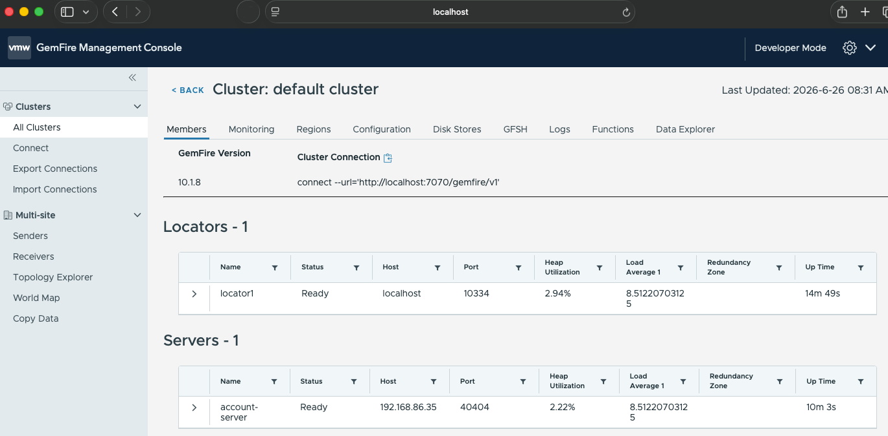

# Account Server

This projects provides an example of a [Spring Boot](https://spring.io/projects/spring-boot) Peer-To-Peer GemFire server 
that uses [Spring Boot for Tanzu GemFire](https://techdocs.broadcom.com/us/en/vmware-tanzu/data-solutions/spring-boot-for-tanzu-gemfire/1-0/gf-sb/index.html) version 1.




Prerequisite

- GemFire 10.1.8
- Java 17


Note:  Using GemFire server annotations such as @CacheApplicationServer in Spring Boot for Tanzu Gemfire version 1.0.0 is currently deprecated. GemFire deployments following this convention should plan to migrate to the version 2 and higher of Spring Boot for VMware GemFire.


# Getting Started Cluster


Start Locator using Gfsh

```shell
cd $GEMFIRE_HOME/bin
./gfsh -e "start locator --name=locator1 --port=10334 --bind-address=127.0.0.1"
```


Start Server


```shell
mkdir -p runtime/server1
java  --add-exports java.management/sun.management=ALL-UNNAMED  --add-exports=java.base/sun.nio.ch=ALL-UNNAMED --add-exports=java.management/com.sun.jmx.remote.security=ALL-UNNAMED --add-opens=java.base/java.lang=ALL-UNNAMED --add-opens=java.base/java.nio=ALL-UNNAMED --add-opens=jdk.management/com.sun.management.internal=ALL-UNNAMED -Dgemfire.start-locator=  -Dgemfire.cache-xml-file=$PWD/applications/server/account-server/src/main/resources/cache.xml -jar applications/server/account-server/target/account-server-0.0.1-SNAPSHOT.jar  --spring.data.gemfire.pool.locators="localhost[10334]" --gemfire.working.dir=runtime/server1 --gemfire.server.name=account-srv1  --gemfire.server.port=40001 --gemfire.statistic.archive.file=runtime/server1/server1.gfs
```


See Cache.xml

```xml
<?xml version="1.0" encoding="UTF-8"?>
<cache
        xmlns="http://geode.apache.org/schema/cache"
        xmlns:xsi="http://www.w3.org/2001/XMLSchema-instance"
        xsi:schemaLocation="http://geode.apache.org/schema/cache http://geode.apache.org/schema/cache/cache-1.0.xsd"
        version="1.0">

    <disk-store name="PDX_STORE">
        <disk-dirs>
            <disk-dir>.</disk-dir>
        </disk-dirs>
    </disk-store>
    <disk-store name="partitionedPersistedDiskStoreName">
        <disk-dirs>
            <disk-dir>.</disk-dir>
        </disk-dirs>
    </disk-store>

    <pdx read-serialized="false">
        <pdx-serializer>
            <class-name>org.apache.geode.pdx.ReflectionBasedAutoSerializer</class-name>
            <parameter name="classes">
                <string>.*</string>
            </parameter>
        </pdx-serializer>
    </pdx>

    <region name="Account">
        <region-attributes refid="PARTITION"/>
    </region>

    <region name="Account_persisted">
        <region-attributes refid="PARTITION_PERSISTENT" disk-store-name="partitionedPersistedDiskStoreName"/>
    </region>

    <region name="Account_replicated">
        <region-attributes refid="REPLICATE"/>
    </region>
    <function-service>
        <function>
            <class-name>io.cloudNativeData.spring.gemfire.account.function.NoOpFunction</class-name>
        </function>
    </function-service>

</cache>
```


Verification

Connect in gfsh

```shell
cd $GEMFIRE_HOME/bin
```

Start gfsh

```shell
./gfsh
```

Connect

```shell
connect
```

List members

```shell
list members
```

List regions

```shell
list regions
```





## Connect GemFire Management Console



Click default cluster


