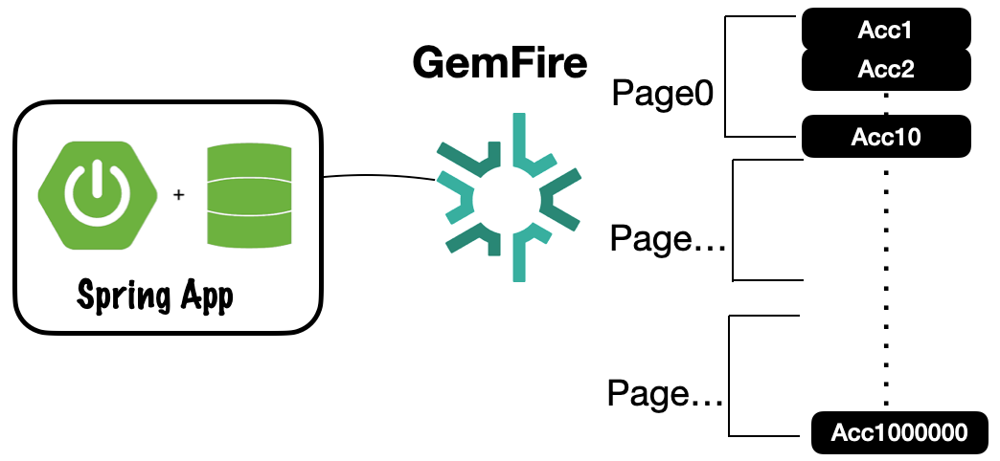

# Paging Region Data Sets




This is an example recall for how to page through large records of a gym fire region.
The general strategy is the following.

1. Get All Keys
2. Split keys into a list of list of keys
3. Get list of keys based on page index var pagedKeys = list.get(pageIndex)
4. Get region values with batched keys var pageValues = region.getAll(pagedKeys)

See [AccountPagingService.java](src/main/java/io/cloudNativeData/spring/gemfire/service/AccountPagingService.java)

# Getting Stared

Start GemFire

```shell
deployments/local/scripts/podman/start-gemfire-external-clients.sh
```

Launch gfsh (Ex: in Podman)

```shell
podman exec -it gf-locator gfsh
```

Connection to locator

```gfsh
connect
```

Create Account Region

```gfsh
create region --name=Account --type=PARTITION
```

Start Account Paging App

```shell
java -jar applications/service/account-paging/target/account-paging-0.0.1-SNAPSHOT.jar --spring.data.gemfire.pool.locators="localhost[10334]" --server.port=6777
```


Open Swagger UI

```shell
open http://localhost:6777/swagger-ui.html
```

---------------
# Testing


Generate Accounts 1 million accounts saving 1000 records at a time.
*Note:* The response contains the number of accounts saved.

```shell
curl -X 'PUT' \
  'http://localhost:6777/generator/account/100000/1000' \
  -H 'accept: */*'
```

Generate pages for all accounts where each page a max of 10 records.
Notes: The response contains the number of pages.

```shell
curl -X 'POST' \
  'http://localhost:6777/accounts/paging/pages' \
  -H 'accept: */*' \
  -H 'Content-Type: application/json' \
  -d '{
  "pageSize": 10
}'
```

Get the first page.
Note: The index starts with 0-9999

```shell
curl -X 'GET' \
  'http://localhost:6777/accounts/paging/page/0' \
  -H 'accept: */*'
```

Look formated JSON for next page

```shell
curl -X 'GET' 'http://localhost:6777/accounts/paging/page/1' -H 'accept: */*' | jq
```


Get the last page

```shell
curl -X 'GET' \
  'http://localhost:6777/accounts/paging/page/9999' \
  -H 'accept: */*'
```