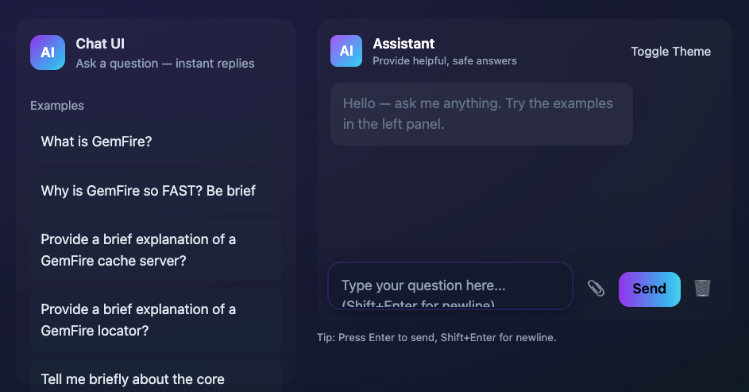

# Chat AI UI with GemFire

Screen shot




Pre-requisite

- GIT
- Java SDK 17 or 21
- GemFire Token 
- GemFire In-Memory [NO-SQL](https://en.wikipedia.org/wiki/NoSQL) data management solution [GemFire](https://gemfire.dev/)
- Podman
*Example on Mac*
```
brew install podman
```
- Ollama

*Example on Mac*
```text
brew install ollama
```
- Spring Cloud Data Flow (instructors included in link below)


# Getting Started

See startup instruction

[GemFire_For_AI-QUICK.md](../../../docs/demo/ai/GemFire_For_AI-QUICK.md)
