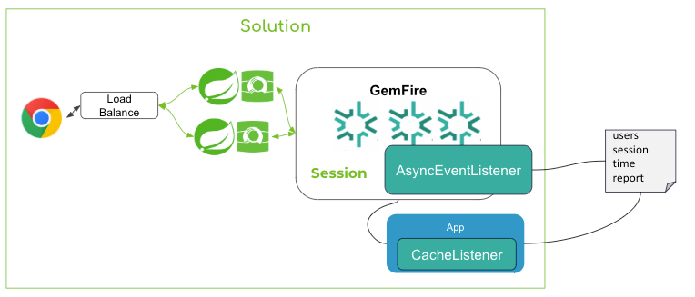
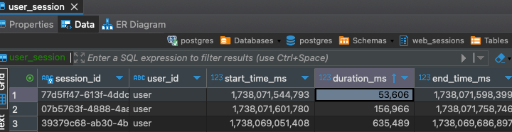

# web-session-listener

This example application illustrates how to track user session duration times.
This example works with [Spring Security](https://spring.io/projects/spring-security) and
[Spring Session for Tanzu GemFire](https://techdocs.broadcom.com/us/en/vmware-tanzu/data-solutions/spring-session-for-tanzu-gemfire/1-0/gf-ss-1-0/index.html).



This web session listener is a standalone Spring Boot application with a GemFire Cache Listener. 
It registers interests to GemFire for changes to the region where GemFire-and spring stores the user sessions data.
The listener is provided the sessions detail when a user logs into the session or the sessions data is destroyed. 
The listener can be durable (by setting the property spring.data.gemfire.cache.client.durable-client-id) 
or non-durable. Durable means the events are an at least once delivery. Events are stored for later 
delivery if the app is not running.  Non-durable listeners only receive current events.

See properties [ClientClientApplication](https://gemfire.dev/api/spring-data/3.1-gemfire-10.1/org/springframework/data/gemfire/config/annotation/ClientCacheApplication) java docs.

The region keys contains the session ID. The user session data is stored in PDX. 
Spring sessions maintains the creation timestamp and the user name in the principal name field.
Note the session destroy event only contains the sessions id. This would need to be correlated with 
the creations event to match the username on provided with the principal name attribute. 
This example using a database table with the username, creation id and session during the creation event.
It selects the creation time by session id to determine the duration when the session entry is destroyed.

A similar approach of using a standalone listener  can be used for web applications that do not use spring security with Gemfire HTTP sessions support.

Note: There is an overhead of maintain changes events for the listener app. 
Session events can build up on the server. This example uses [Spring@Async](https://spring.io/guides/gs/async-method) threading 
to improve event processing speed. Also note that durable listener events also take up additional disk space.


## Spring Properties

Also see [ClientClientApplication](https://gemfire.dev/api/spring-data/3.1-gemfire-10.1/org/springframework/data/gemfire/config/annotation/ClientCacheApplication) java docs.

| property                                                | Notes                                                                                                                                                                                             |
|---------------------------------------------------------|---------------------------------------------------------------------------------------------------------------------------------------------------------------------------------------------------|
| spring.data.gemfire.cache.client.durable-client-id      | If set, the durable client ID indicates a client is durable so messages persist while the client is offline.                                                                                      |
 | spring.data.gemfire.pool.default.locators               | Configures the Locators to which this cache client will connect.                                                                                                                                  |
| spring.data.gemfire.pool.subscription-redundancy        | Configures the redundancy-level for the DEFAULT Pool's server-to-client subscriptions.                                                                                                            |
| spring.data.gemfire.cache.client.durable-client-timeout | Configures the number of seconds that a durable client can remain disconnected from a server cluster and for the servers to continue to accumulate (durable) events for the client while offline. |
| spring.session.data.gemfire.session.region.name         | Default ClusteredSpringSessions                                                                                                                                                                   |


**Prerequisites**

The users session has been verified to save to H2 and [Postgres](https://www.vmware.com/products/app-platform/tanzu-for-postgres).


- Java 17
- apache-maven version 3.9.1 or higher
- Docker
- GemFire 10.x


# Demo Instructions


The following is an example of creating the default Spring Sessions region
using Gfsh.


```shell
create region --name=ClusteredSpringSessions --type=PARTITION
```

# Testing

By default this listener application stores user session details  
in-memory using an H2 database.


## Using H2
Run the application to us H2

```shell
java -jar applications/web/web-session-listener/target/web-session-listener-0.0.1-SNAPSHOT.jar
```


Example log output

```shell
2025-01-28T08:42:38.751-05:00  INFO 32766 --- [web-session-listener] [  UserSession-1] s.g.s.w.s.s.UserSessionDataService       : Duration :156966 millisecond, for User details: UserSession(sessionId=07b5763f-4888-4aa3-a54b-94d93c7dcf4a, userId=user, startTimeMs=1738071601780, endTimeMs=1738071758746, durationMs=156966) 
```

## Using Postgres 


This reference application also support saving session details to Postgres.

See the following to start Postgres in Docker using a [Bitnami](https://bitnami.com/) image.

```shell
./deployments/local/scripts/docker/start-postgres.sh
```


The following will same the details in Postgres

```shell
java -jar applications/web/web-session-listener/target/web-session-listener-0.0.1-SNAPSHOT.jar --spring.profiles.active="postgres" --spring.datasource.url="jdbc:postgresql://localhost:5432/postgres" --spring.datasource.username="postgres"
```

Example data in Postgres using DBeaver

