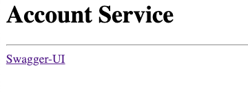
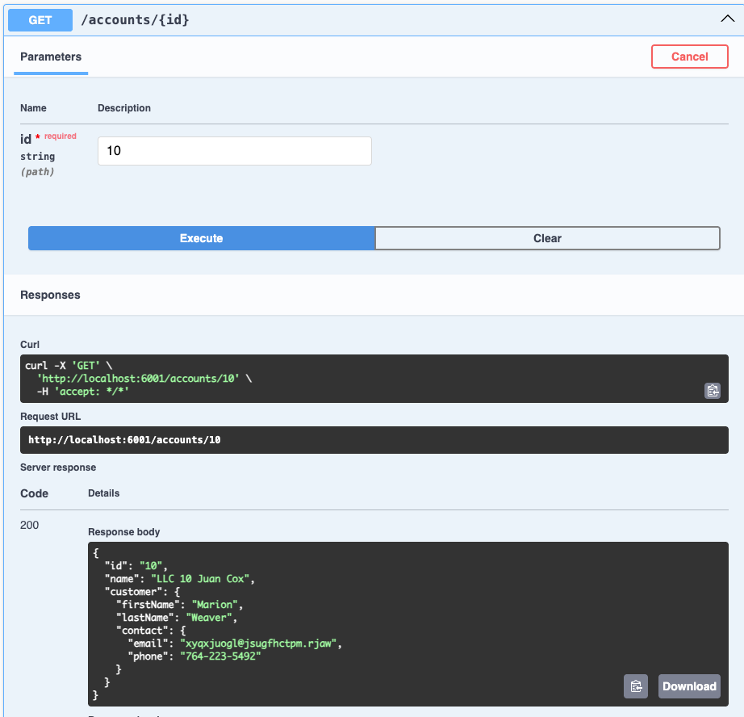

# GemFire as a Database Cache

This demo will demonstrate using GemFire as cache for data that does not change often. 

In this example, using data in a relationship databases
and loads it into GemFire using [Spring Batch](https://spring.io/projects/spring-batch).


## Getting Started


- Start RDBMS Database
```shell
mkdir -p /Users/devtools/repositories/RDBMS/PostgreSQL/pg-podmon
podman run --name postgresql --network tanzu -it --rm -p 5432:5432 -e ALLOW_EMPTY_PASSWORD=yes -v /Users/devtools/repositories/RDBMS/PostgreSQL/pg-podmon:/bitnami/postgresql bitnami/postgresql:latest
```
- Start GemFire
```shell
./deployments/local/scripts/gemfire/start-2-data-nodes.sh
```

- Start Batch Load with 10K generated records
```shell 
java -jar applications/account-batch/target/account-batch-0.0.1-SNAPSHOT.jar --spring.profiles.active=postgres  --db.schema=cache_accounts --spring.data.gemfire.pool.default.locators="localhost[10334]" --batch.jdbc.url="jdbc:postgresql://localhost:5432/postgres"  --batch.jdbc.username=postgres --spring.sql.init.platform=postgres --batch.job.repository.create=true --spring.datasource.url="jdbc:postgresql://localhost:5432/postgres" --spring.datasource.username=postgres --batch.load.accounts=true --account.data.count=10000  --account.data.batch.size=50 --spring.data.gemfire.pool.default.locators="localhost[10334]" 
```
- Start Account Service
```shell
java -jar applications/account-service/target/account-service-0.0.2-SNAPSHOT.jar --server.port=6001 --spring.data.gemfire.pool.default.locators="localhost[10334]"
```
- Access data Service

```shell
open http://localhost:6001
```






## Demo Applications

| Applications                                              | Notes                                                 |
|-----------------------------------------------------------|-------------------------------------------------------| 
| [account-batch](../../../applications/account-batch)      | Spring Batch application to load data into GemFire    |
| [account-service](../../../applications/account-service)  | Spring Web Application to access GemFire              |

